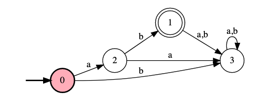
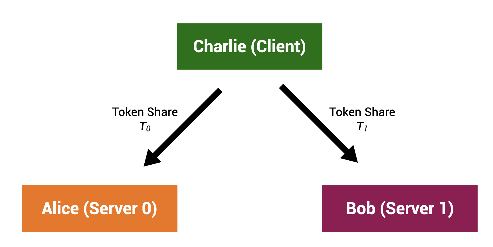

# Private Multiparty State Machine

> This is a fork of [TinySMPC](https://github.com/kennysong/tinysmpc), A tiny library for [secure multi-party computation](https://en.wikipedia.org/wiki/Secure_multi-party_computation), in pure Python. For more information on TinySMPC, please refer to the original repository and its fantastic tutorial!

## **Introduction**

The goal of the protocol is to run a private [state machine](https://en.wikipedia.org/wiki/Finite-state_machine). Privacy in this case means that those who are running this machine should not know what state it currently is in (the number in the circle). They should also no know what inputs are being fed into the machine (the 'a' and 'b' characters on arrows). The only thing that they have knowledge on is the specific machine that they are running.

## **Example: 2-Server, 1-Client Private State Machine**

The following diagram shows the communication between 2 servers and 1 client. In the protocol Charlie is the client and Alice and Bob are the servers. Charlie has no knowledge of the state machine that is being run whereas Alice and Bob do. Charlie continually sends inputs to Alice and Bob, causing the private state machine to transition.

### **Privacy Properties**

> **WARNING**: If Alice and Bob collude, they can learn the state of the machine as well as the inputs.

- **Private State**: Alice and Bob do not know the current state.
- **Private Input**: Alice and Bob do not know the input.

## **Notebooks**

- [Naive Private State Machine](./naive_private_state_machine.ipynb)
- [Optimized Private State Machine](./optimized_private_state_machine.ipynb)
